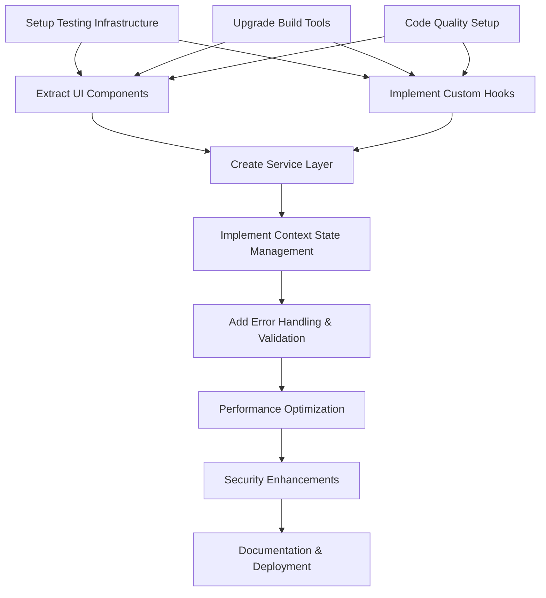

# BabelPrompt Refactoring Execution Plan
**Generated**: 2025-12-07 by ADO v3.0
**Intelligence Sources**: Technical research + Domain analysis + Competitive intelligence
**Confidence Level**: HIGH

## Task DAG (Dependency Graph)

## Phase 1: Foundation Infrastructure (Priority: CRITICAL)

### Task 1.1: Testing Infrastructure Setup
**Dependencies**: None
**Estimated Time**: 2 hours
**Evidence Requirements**:
- Vitest configuration file
- Sample test suite passing (≥80% coverage)
- Test execution log

**Falsifiable Acceptance Criteria**:
- [ ] `npm test` runs without errors
- [ ] Coverage report shows >80% for tested components
- [ ] CI pipeline passes all tests
- [ ] Test execution time < 10 seconds

### Task 1.2: Build Tools Upgrade
**Dependencies**: None
**Estimated Time**: 1 hour
**Evidence Requirements**:
- Updated package.json with Vite 6.x
- Successful build output
- Bundle analysis report

**Falsifiable Acceptance Criteria**:
- [ ] Build completes without warnings
- [ ] Bundle size < 1MB (gzipped)
- [ ] HMR works < 200ms
- [ ] TypeScript compilation without errors

### Task 1.3: Code Quality Infrastructure
**Dependencies**: Build Tools Upgrade
**Estimated Time**: 1 hour
**Evidence Requirements**:
- ESLint configuration
- Prettier setup
- Pre-commit hooks working

**Falsifiable Acceptance Criteria**:
- [ ] `npm run lint` completes without errors
- [ ] Code formatting consistent across files
- [ ] Pre-commit hooks prevent bad commits
- [ ] TypeScript strict mode enabled

## Phase 2: Component Architecture Refactoring (Priority: HIGH)

### Task 2.1: UI Component Extraction
**Dependencies**: Testing Infrastructure, Build Tools, Code Quality
**Estimated Time**: 4 hours
**Evidence Requirements**:
- Component files in `/src/components/ui/`
- All components render successfully
- Storybook (optional) working

**Falsifiable Acceptance Criteria**:
- [ ] Button, Textarea, LoadingSpinner components extracted
- [ ] Components accept consistent props interface
- [ ] No inline styles in UI components
- [ ] Components have TypeScript definitions

### Task 2.2: Business Logic Extraction (Custom Hooks)
**Dependencies**: Testing Infrastructure, Build Tools, Code Quality
**Estimated Time**: 3 hours
**Evidence Requirements**:
- Hook implementations in `/src/hooks/`
- Unit tests for all hooks
- Type definitions for hook interfaces

**Falsifiable Acceptance Criteria**:
- [ ] `useGeminiAPI` hook with error handling
- [ ] `useTypewriter` hook with performance optimization
- [ ] `useChatState` hook for state management
- [ ] All hooks have >90% test coverage

### Task 2.3: Service Layer Implementation
**Dependencies**: UI Components, Custom Hooks
**Estimated Time**: 2 hours
**Evidence Requirements**:
- API service implementations
- Mock service for testing
- Error handling patterns

**Falsifiable Acceptance Criteria**:
- [ ] API calls abstracted to service layer
- [ ] Mock services work in test environment
- [ ] Error boundaries catch API failures
- [ ] Response type safety ensured

## Phase 3: Advanced Features (Priority: MEDIUM)

### Task 3.1: Context State Management
**Dependencies**: Service Layer, Custom Hooks
**Estimated Time**: 3 hours
**Evidence Requirements**:
- Context providers implemented
- State flow documentation
- Performance benchmarks

**Falsifiable Acceptance Criteria**:
- [ ] No prop drilling required
- [ ] State changes trigger minimal re-renders
- [ ] Context providers are properly typed
- [ ] State persistence works (localStorage)

### Task 3.2: Error Handling & Validation
**Dependencies**: Context State Management
**Estimated Time**: 2 hours
**Evidence Requirements**:
- Error boundary components
- Input validation logic
- Error reporting system

**Falsifiable Acceptance Criteria**:
- [ ] App doesn't crash on API errors
- [ ] User input is validated before API calls
- [ ] Error messages are user-friendly
- [ ] Error states are properly tracked

### Task 3.3: Performance Optimization
**Dependencies**: Error Handling
**Estimated Time**: 3 hours
**Evidence Requirements**:
- Performance benchmarks (Lighthouse)
- Bundle optimization
- Memory usage analysis

**Falsifiable Acceptance Criteria**:
- [ ] Lighthouse performance score > 90
- [ ] Initial load time < 2 seconds
- [ ] React DevTools shows no unnecessary re-renders
- [ ] Memory usage stable during extended use

## Phase 4: Security & Production Ready (Priority: HIGH)

### Task 4.1: Security Enhancements
**Dependencies**: Performance Optimization
**Estimated Time**: 2 hours
**Evidence Requirements**:
- Security audit report
- CSP headers configuration
- API key protection

**Falsifiable Acceptance Criteria**:
- [ ] No API keys exposed in frontend code
- [ ] All user inputs are sanitized
- [ ] CSP headers implemented
- [ ] Rate limiting for API calls

### Task 4.2: Documentation & Deployment
**Dependencies**: Security Enhancements
**Estimated Time**: 2 hours
**Evidence Requirements**:
- Complete README documentation
- Deployment configuration
- Version control setup

**Falsifiable Acceptance Criteria**:
- [ ] README includes setup and contribution guidelines
- [ ] Deployment process automated
- [ ] Version tags properly created
- [ ] All artifacts in `.ado/delivery/`

## Risk Matrix

| Risk | Probability | Impact | Mitigation | Validation |
|------|-------------|--------|-----------|------------|
| Component extraction breaks functionality | MEDIUM | HIGH | Comprehensive test coverage | All tests pass after each extraction |
| Performance regression during refactoring | LOW | HIGH | Performance benchmarks at each phase | Lighthouse score maintained > 85 |
| API key exposure during refactoring | LOW | CRITICAL | Environment variable validation | No API keys in git history |
| TypeScript compilation errors | HIGH | MEDIUM | Incremental compilation checks | Build passes at each commit |
| State management complexity | MEDIUM | MEDIUM | Simplified state patterns | Context providers < 100 lines each |

## Evidence Requirements Summary

### For Each Phase:
1. **Implementation Artifacts**: Code files, configuration files
2. **Validation Methods**: Test suites, benchmarks, audits
3. **Proof Format**:
   - Test execution logs (`.ado/evidence/tests/`)
   - Performance benchmarks (`.ado/evidence/benchmarks/`)
   - Validation screenshots/logs (`.ado/evidence/validations/`)

### Final Delivery Package:
- **VERIFICATION.md**: Step-by-step validation guide
- **IMPLEMENTATION.md**: Technical implementation details
- **Evidence Package**: Complete execution proof
- **Migration Guide**: From old to new architecture

## Success Metrics

### Technical Metrics:
- **Test Coverage**: >85% (target: 90%)
- **Bundle Size**: <500KB gzipped (target: <300KB)
- **Performance**: Lighthouse score >90
- **Build Time**: <30 seconds (target: <15s)

### User Experience Metrics:
- **Initial Load**: <2 seconds
- **Interaction Response**: <100ms
- **Error Rate**: <1% of user interactions
- **Accessibility Score**: >95

### Development Experience Metrics:
- **Hot Reload**: <200ms
- **Test Execution**: <10 seconds
- **Type Checking**: <5 seconds
- **Linting**: <3 seconds

## Execution Strategy

### Parallel Execution Opportunities:
- **Phase 1 Tasks**: Can run in parallel (3 concurrent agents)
- **Phase 2 Tasks**: UI Components ↔ Custom Hooks (parallel)
- **Phase 3 Tasks**: Can overlap with Phase 2 completion

### Checkpoints:
- **Post-Phase 1**: Foundation validated
- **Post-Phase 2**: Core refactoring complete
- **Post-Phase 3**: Feature implementation done
- **Post-Phase 4**: Production ready

### Rollback Strategy:
- **Git Tags**: Create tags before each major phase
- **Feature Flags**: Enable/disable new features
- **A/B Testing**: Gradual rollout option
- **Backup Strategy**: Keep original code in `/legacy/`

---

**Total Estimated Time**: 23 hours
**Recommended Execution**: TURBO mode with 2-3 parallel agents
**Evidence-Driven**: Every task must pass validation before completion